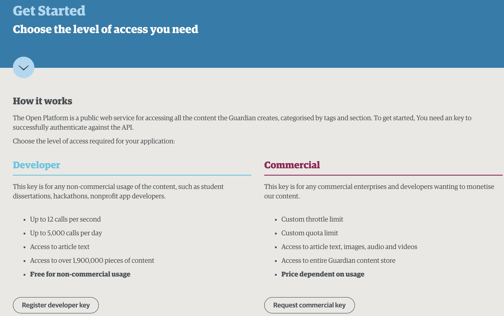

##  {data-background="../img/ucl_artwork/ucl-banner-land-darkblue-rgb.png" data-background-size="70%" data-background-position="top" data-background-opacity="1"}

</br>

Applied Data Science

</br>

**What is this? and Why do we need it?**

## Aaah: so we're talking Big Data!


## Problems with "Big Data"

- what is "big"?
- data = data?
- complexity of data?
- sexiness of small data

## Things you'll do

- Accessing news article data and academic literature through APIs
- Building proper web-scrapers to collect data on the FBI's most wanted terrorists
- Analysing patterns of language use in text data
- Utilising Natural Language Processing to understand controversial news coverage
- Identifying the semantic relationships of concepts through automated methods
- Building fake news and sentiment classification systems using machine learning
- Utilising clustering to identify patterns in YouTube videos
- Building neural networks for prediction tasks

+ your own project

## Learning hours

| Component                    	| Amount 	| Duration 	| Total hours 	|
|------------------------------	|--------	|----------	|-------------	|
| Lectures                     	| 10     	| 1h       	| 10h         	|
| Tutorials/practicals         	| 10     	| 1h       	| 10h         	|
| Assessment: class test       	| 1      	| 1.5h     	| 1.5h        	|
| Assessment: project          	| 1      	| 40.5h    	| 40.5h       	|
| Homework/revision/self-study 	| 11     	| 8h       	| 88h         	|
| TOTAL                        	| -      	| -        	| 150         	|

$\approx$ 14 hours per week

## Becoming a real problem-solver

- Principle 1: There's no magic in Data Science
- Principle 2: Data never come in a spreadsheet
- Principle 3: Data are hidden in front of you
- Principle 4: Programming can only ever be the vehicle

##

~~It all starts with the data.~~

It all starts with a problem.

##

## Week 1: Web data collection 1

## Today

- Types of webscraping
- Using APIs
- "Real" webscraping: basics of a webpage

## What is webscraping anyway?

## The game changer!

- direct broadcasting of ideas
- "unfiltered" and "uncensored" (?)
- location-enabled
- and: _en masse_


## Types of webscraping

|   | Data shared | Data not shared |
|------------------|-------------|-----------------|
| Ready-made table | Download | _closed source_ |
| Not ready-made | API | Real webscraping |

## 

### Application programming interfaces (APIs)

## API: basics

Goal:

- helping developers interact with the platform
- facilitating interaction in an automatable manner
- analogous to the GUI
- part of it: enabling data access
- contains precise documentation

## What an API does not do:

- give you all the data
- be free forever
- give you full control

There's no free lunch!

## Core elements of an API:

- GET requests
- POST requests

Implementable in different ways...


## Classes of APIs

1. Web APIs
    - send requests through the browser
    - add URL parameters
    `https://data.police.uk/api/crimes-at-location?date=2017-08&location_id=884227`
2. Libraries/packages for APIs
    - depending on the API: python, js, php, ruby
    - = frameworks to access the API
    - = methods implemented in different languages
3. API wrappers
    - R packages that use the API


## Useful websites that have an API

- Twitter (`twitteR`, `rtweet`)
- YouTube (`tuber`)
- Instagram
- Facebook
- Reddit
- The Guardian

**Recommended: try online tutorials**

## API: Newspaper coverage

Accessing The Guardian data using [`GuardianR`](https://rdrr.io/cran/GuardianR/man/get_guardian.html)

```{r eval=F}
library(GuardianR)

get_guardian("SOME SEARCH TERM",
             from.date="START_DATE",
             to.date="END_DATE",
             api.key="YOUR_ACCESS_KEY")
```

## How to obtain the access key?

[https://open-platform.theguardian.com/access/](https://open-platform.theguardian.com/access/)



## Step 1: sending API requests

Aim: search for keyword "crime" in Aug 2019

```{r eval=F}
request.crime = get_guardian("crime",
                             from.date="2019-08-01",
                             to.date="2019-08-31",
                             api.key="ea765...")
```

```{r echo=F}
load("./guardian_crime_aug2019.RData")
```

_Note: save these requests in an R object (variable)_

## Step 2: understanding the data

Dimensions (rows, columns) of the `request.crime` object

```{r}
dim(request.crime)
```

## Column names

```{r}
names(request.crime)
```

## Displaying the data

```{r echo=F}
knitr::kable(request.crime[1:5, c(1,3,5,10)])
```

## Displaying the data

```{r echo=F}
knitr::kable(request.crime[11:15, c(10, 17, 21, 23)])
#note: this displays rows 11-15 and columns 10, 17, 21, and 23
```

## The article body

```{r echo=F}
as.character(request.crime$body[33])
```

## Step 3: using the data

Note: not all sections are relevant (e.g., book reviews vs politics vs uk news) 

Option 1: sending a new API request [R package docs](https://rdrr.io/cran/GuardianR/man/get_guardian.html)

```{r eval=F}
library(GuardianR)
request.crime.uknews = get_guardian("crime",
                                    from.date="2019-08-01",
                                    to.date="2019-08-31",
                                    section = 'uk-news', 
                                    api.key="ea765...")
```


```{r echo=F}
load("./guardian_crime_uknews_aug2019.RData")
```

## "UK News"" crime coverage

```{r}
dim(request.crime.uknews)
```

## 

```{r}
knitr::kable(request.crime.uknews[1:5, c(1,3,5,10)])
```


## Option 2: subsetting the data

```{r}
crime_data_uknews = request.crime[request.crime$sectionId == "uk-news", ]
dim(crime_data_uknews)
```

## Step 3: Using the data

Aim: investigate article length

```{r echo=F}
plot(as.numeric(as.character(request.crime.uknews$wordcount))
     , pch = 19
     , ylab = 'No. of words'
     , main = "Crime article lengths (UK News section)")
```

## ... by author

```{r echo=F}
plot(as.numeric(as.character(request.crime.uknews$wordcount))
     , pch = 19
     , ylab = 'No. of words'
     , col=request.crime.uknews$byline
     , main = "Crime article lengths (UK News section)")
```


## Numerically

```{r}
tapply(X = as.numeric(as.character(request.crime.uknews$wordcount))
       , INDEX = request.crime.uknews$byline
       , FUN = mean)
```


## APIs: Pros & Cons 

**Pro**

- easy to access
- nicely documentation
- **works even if website changes**

**Cons**

- quota limits ($ $ $)
- under the platforms' control
- only for few platforms

##

### Don't let the data determine your research!


##

## Beyond APIs

What about:


##


## No APIs

- incels.me
- Stormfront
- 4chan

+ **APIs are restrictive!**

## ... what about:

### Your research project --> no API?


##

Main problem:

**Really ‘juicy’ data of the Internet** vs **APIs**

## "Real" webscraping: basics of a webpage

## Three elements of a webpage

1. Structure
2. Behaviour
3. Style

## Three elements of a webpage

1. Structure
2. Behaviour
    - JavaScript (**!= Java**)
    - user interaction
    - examples: alerts, popups, server-interaction
3. Style

## Three elements of a webpage

1. Structure
2. Behaviour
3. Style
    - CSS (Cascading Style Sheets)
    - formatting, design, responsiveness
    - examples: submit buttons, app interfaces

## Three elements of a webpage

1. Structure
    - HTML (hypertext markup language)
    - structured with `<tags>`
    - contains the pure content of the webpage
2. Behaviour
3. Style

## For now: HTML

The very basics of HTML:

**Raw architecture of a webpage**

```{html}
<!DOCTYPE html>
<html>
<body>

HERE COMES THE VISIBLE PART!!

</body>
</html>
```


*Note:* Every tags `< >` is closed `< />`. Content is contained within the tag.

## HTML basics

Ways to put content in the `<body> ... </body>` tag:

- headings: `<h1>I'm a heading at level 1</>`


## Content in the body tag

- paragraphs: `<p>This is a paragraph</p>`


## Web scraping logic

If all webpages are built in this structure...

... then we could access this structure programmatically.

## But where do I find that structure?

Is it just "there"?

**YES!!**

## How to see the html structure?


##


##


##


##


## Webscraping in a nutshell

1. understand the structure of a webpage
2. exploit that structure for web-scraping

## What's next?

- Today's tutorial: - Today's tutorial: building your own API scraper, using the data, some HTML
- Homework: arxiv scraping, Twitter access, project start


Next week: Web scraping 2 (more HTML, browser simulation)

